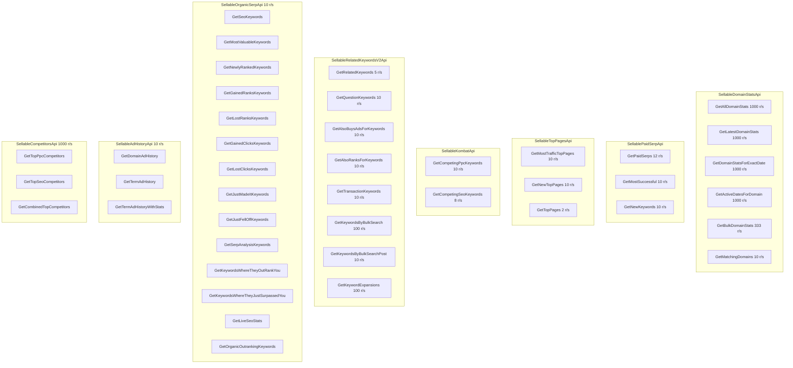

# API Rate Limits

To ensure fair usage and system stability, our API enforces **rate limits**. Each endpoint has a maximum number of requests allowed per second. When the limit is exceeded, requests are throttled and the API returns `429 Too Many Requests`.

***

## How Rate Limits Work

* **Per‑endpoint limits**: Each API method has its own requests‑per‑second (RPS) allowance.
* **Window**: Limits apply over a rolling **1‑second** window.
* **Retry**: If you exceed the limit, wait **1 second** before retrying (see `Retry‑After` header).
* **Why different limits?** Heavier endpoints allow fewer requests per second based on relative compute cost.

**Example 429 response**

```http
HTTP/1.1 429 Too Many Requests
Retry-After: 1
Content-Type: application/json
```

```json
{
  "error": "rate_limited",
  "message": "Too many requests. Please retry after 1 second."
}
```

***

## Controller-Level Overview (Uniform Limits)

These controllers use the same limit across all listed methods.

| Controller                 | Requests / Sec |
| -------------------------- | -------------- |
| SellableAdHistoryApi       | 10             |
| SellableOrganicSerpApi     | 10             |
| SellableCompetitorsApi     | 1000           |
| SellableHistoricRankingApi | 10             |

> For all other controllers, see per‑endpoint limits below.

***

## Endpoint-Specific Limits

### SellableDomainStatsApi

| Endpoint                   | Requests / Sec |
| -------------------------- | -------------- |
| GetAllDomainStats          | 1000           |
| GetLatestDomainStats       | 1000           |
| GetDomainStatsForExactDate | 1000           |
| GetActiveDatesForDomain    | 1000           |
| GetBulkDomainStats         | 333            |
| GetMatchingDomains         | 10             |

### SellablePaidSerpApi

| Endpoint          | Requests / Sec |
| ----------------- | -------------- |
| GetPaidSerps      | 12             |
| GetMostSuccessful | 10             |
| GetNewKeywords    | 10             |

### SellableTopPagesApi

| Endpoint               | Requests / Sec |
| ---------------------- | -------------- |
| GetMostTrafficTopPages | 10             |
| GetNewTopPages         | 10             |
| GetTopPages            | 2              |

### SellableKombatApi

| Endpoint                | Requests / Sec |
| ----------------------- | -------------- |
| GetCompetingPpcKeywords | 10             |
| GetCompetingSeoKeywords | 8              |

### SellableRelatedKeywordsV2Api

| Endpoint                    | Requests / Sec |
| --------------------------- | -------------- |
| GetRelatedKeywords          | 5              |
| GetQuestionKeywords         | 10             |
| GetAlsoBuysAdsForKeywords   | 10             |
| GetAlsoRanksForKeywords     | 10             |
| GetTransactionKeywords      | 10             |
| GetKeywordsByBulkSearch     | 100            |
| GetKeywordsByBulkSearchPost | 10             |
| GetKeywordExpansions        | 100            |

### SellableOrganicSerpApi _(uniform: 10 r/s)_

| Endpoint                             | Requests / Sec |
| ------------------------------------ | -------------- |
| GetSeoKeywords                       | 10             |
| GetMostValuableKeywords              | 10             |
| GetNewlyRankedKeywords               | 10             |
| GetGainedRanksKeywords               | 10             |
| GetLostRanksKeywords                 | 10             |
| GetGainedClicksKeywords              | 10             |
| GetLostClicksKeywords                | 10             |
| GetJustMadeItKeywords                | 10             |
| GetJustFellOffKeywords               | 10             |
| GetSerpAnalysisKeywords              | 10             |
| GetKeywordsWhereTheyOutRankYou       | 10             |
| GetKeywordsWhereTheyJustSurpassedYou | 10             |
| GetLiveSeoStats                      | 10             |
| GetOrganicOutrankingKeywords         | 10             |

### SellableAdHistoryApi _(uniform: 10 r/s)_

| Endpoint                  | Requests / Sec |
| ------------------------- | -------------- |
| GetDomainAdHistory        | 10             |
| GetTermAdHistory          | 10             |
| GetTermAdHistoryWithStats | 10             |

### SellableHistoricRankingApi _(uniform: 10 r/s)_

| Endpoint                               | Requests / Sec |
| -------------------------------------- | -------------- |
| GetHistoricRankingsForDomain           | 10             |
| GetHistoricRankingsForKeywordOnDomains | 10             |
| GetHistoricRankingsForDomainOnKeywords | 10             |

### SellableCompetitorsApi _(uniform: 1000 r/s)_

| Endpoint                  | Requests / Sec |
| ------------------------- | -------------- |
| GetTopPpcCompetitors      | 1000           |
| GetTopSeoCompetitors      | 1000           |
| GetCombinedTopCompetitors | 1000           |

***

## Visual Overview



***

## Client Recommendations

* **Backoff on 429**: Retry after the number of seconds indicated by `Retry‑After` (typically `1`).
* **Batch or paginate** where supported to reduce call volume.
* **Cache** results to avoid redundant calls.
* **Parallelism**: Cap concurrency so per‑endpoint RPS stays within limit.

***

## Questions?

If you need a higher limit for specific workloads, contact support with:

* The controller/endpoint,
* Expected sustained RPS and burst behavior,
* Use case and time window.
